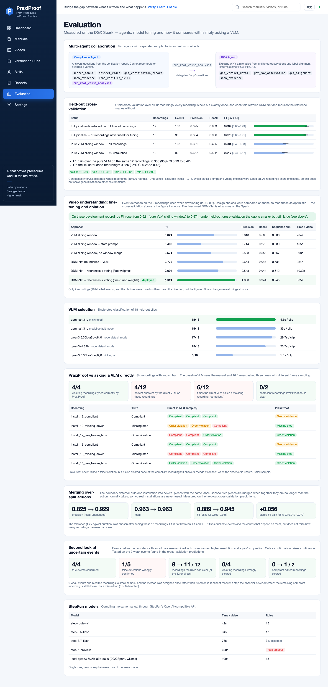
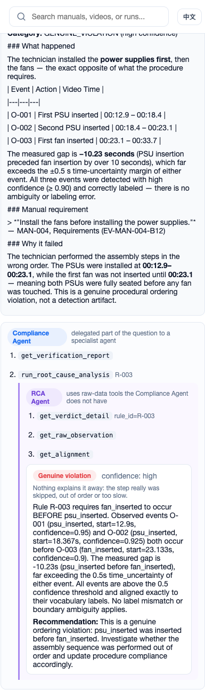
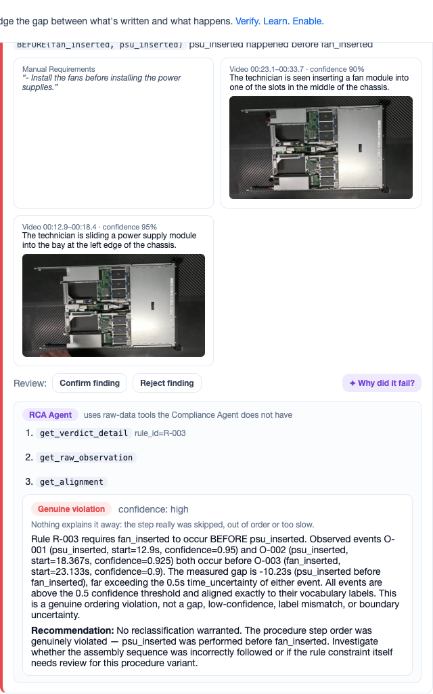

# PraxiProof

Compile procedure manuals into executable constraints, verify operation videos against them
with traceable evidence, and package the result as an agent Skill a technician (or an LLM) can
load. Built for the DGX Spark Hackathon.

## 项目简介与核心亮点

PraxiProof 解决的是工业/数据中心运维里一个具体的问题:操作手册是静态文本,但"技术员是否按流程做对了"需要看视频才知道,而人工逐帧核对代价很高。PraxiProof 把这条链路做成了一个可审计的自动化流水线:

1. **手册 → 可执行约束**:用本地 LLM(Ollama 提供)把 PDF/HTML 手册编译成结构化规则(`MUST_HAVE`/`BEFORE`/`AFTER`/`MAX_INTERVAL`/`MUST_NOT`/`COUNT` 等约束类型),每条规则强制携带手册原文引用(页码/章节),不允许模型凭空生成一条没有出处的规则。
2. **视频 → 时间线事件**:提供三种可切换的视频理解后端——`local_vlm`(纯 Ollama 视觉模型,滑窗粗筛+精修两阶段)、`ddm_vlm`(NVIDIA SOP training blueprint 训练的 DDM-Net 边界检测模型做时序切分,再用 VLM 分类,多帧投票降低幻觉)、`nvidia_sop`(直接对接 NVIDIA `sop-monitoring-blueprints` 的 `sop-inference-bp` 推理服务)。三种后端产出统一的 `Observation` 格式,可以直接对比效果。
3. **确定性验证引擎**:规则和观测事件的比对是纯代码逻辑(不是让 LLM"看着办"),每个 verdict(PASS/VIOLATION/UNVERIFIED/INSUFFICIENT_EVIDENCE)都能追溯到具体的手册引用和视频时间段。
4. **Compliance Agent**:一个工具调用型智能体,只能通过 `get_verification_report`/`search_manual`/`inspect_video`/`show_evidence` 等只读工具回答问题,系统提示词明确禁止它自己重新计算时间或推翻已有 verdict——避免"agent 自由发挥"导致的幻觉。
5. **Skill 打包**:把某次验证的结果编译成一份可分发的 Agent Skill(`SKILL.md` + `references/` + `evals/evals.json` + `BENCHMARK.md` + `skill-card.md`),格式对齐 NVIDIA Verified Skills 规范,细节见下文。

核心亮点是**证据链闭环**:从手册引用、视频时间戳、到最终 verdict,每一步都可追溯,拒绝"黑箱裁决"。这也是为什么验证逻辑本身是确定性代码而不是二次调用 LLM——LLM 只负责"看/读","判断规则是否满足"永远是可复现的代码路径。

## 两个独立 demo 场景:流水线不是围着一份手册硬编码的

`demo/` 下有两套完全独立的手册+规则+录像,证明这套流水线换一份手册就能重新编译、重新验证,而不是针对某一份 demo 数据写死的脚本:

| | 手册 | 约束类型覆盖 | 生成的 Skill 包 |
|---|---|---|---|
| 场景一 | `demo/manuals/dgx-h100-front-fan-replacement.html` | `PRECONDITION`/`BEFORE`/`AFTER`/`MAX_INTERVAL`/`MUST_HAVE` | `demo/sample-skill/dgx-h100-front-fan-module-replacement/` |
| 场景二 | `demo/manuals/server-fan-psu-cover-installation.md` | `PRECONDITION`/`BEFORE`/**`COUNT`**/`MUST_HAVE`/**`MUST_NOT`** | `demo/sample-skill/server-fan-power-supply-and-cover-installation/` |

场景二特意选了场景一完全没触发过的两种约束——"六个风扇必须都装上"(`COUNT`)和"机盖不能在没听到卡扣声的情况下被强行压下"(`MUST_NOT`),外加一段真实拍到的违规录像(`cover_install_C`:六个风扇和两个电源都装对了,但机盖被强行压下、卡扣没锁上)。跑一下就能看到两条规则同时报 VIOLATION,而且原因各不相同:

```bash
uv run praxiproof bench --demo-dir demo --requirements server-fan-psu-cover.json
```

两个场景各自的 `BENCHMARK.md` 都是用真实数据跑出来的(`praxiproof bench --requirements <file> --skill-md <path>`),不是复制粘贴场景一的数字。`tests/test_benchmark.py` 里有回归测试,保证场景二的录像永远不会被错误地拿场景一的规则去打分。

## 系统架构

```
manual (PDF/HTML)                 video (mp4)
      │                                 │
      ▼                                 ▼
  document/extract.py          video/{local_vlm,ddm_vlm,nvidia_sop}_adapter.py
      │                                 │
      ▼                                 │
  constraints/compiler.py (LLM)         │
      │ RequirementSet                  │ Observation (timed events)
      ▼                                 ▼
      └──────────► constraints/engine.py (deterministic) ─────────┐
                          │ VerificationReport (per-rule verdict)  │
                          ▼                                       │
                  compiler/agent_skill.py ──► SKILL.md + evals.json│
                          │                   + skill-card.md      │
                          ▼                   + BENCHMARK.md       │
                  runtime/compliance_agent.py (tool-calling, read-only)
                          │ delegates "why did this fail?" via run_root_cause_analysis
                          ▼
                  runtime/rca_agent.py (separate prompt + raw-data tools)
```

前端是 FastAPI 内置的静态双语(中/英)单页应用(`src/praxiproof/api/static/`),后端 `src/praxiproof/api/app.py` 暴露手册编译、视频上传、一键 pipeline、verdict 复核、Skill 下载、Compliance Agent 问答等 REST 接口。

## 界面截图

评测页(同一份数据的中文版见 `docs/screenshots/evaluation-zh.png`),以及 Agent 追问时展开的协作轨迹——Compliance Agent 委托 RCA Agent,后者用自己的原始数据工具得出结构化结论。截图由 `scripts/ui_smoke.py` 在真实浏览器里跑线上服务时生成,同一个脚本还会在页面出现控制台报错、接口失败或未翻译文本时直接失败。







## 快速开始

```bash
uv sync
uv run praxiproof serve --port 8090        # 启动前后端一体的 Web 服务
uv run praxiproof bench --demo-dir demo    # 在 demo 数据上跑确定性验证引擎的基准测试
uv run pytest -q                           # 单元测试(标记 spark 的用例需要真实 Ollama,默认跳过)
```

## 部署到 DGX Spark

`deploy/deploy.sh` 负责把代码同步到 Spark 并以用户级 systemd service 常驻:

```bash
deploy/deploy.sh                 # rsync 代码 → uv sync → 跑测试 → 重启 praxiproof.service → 健康检查
deploy/deploy.sh --skip-tests    # 跳过测试,加速迭代
```

`deploy/praxiproof.service` 把服务跑在 `0.0.0.0:8090`,通过环境变量指向本地 Ollama(`PRAXIPROOF_OLLAMA_URL=http://127.0.0.1:11434`)。所有可调参数(用哪个 LLM/VLM、用哪个视频后端、DDM 检查点路径、置信度阈值等)既可以用 `PRAXIPROOF_*` 环境变量设置,也可以在跑起来之后通过 `/api/settings` 接口实时热切换(`src/praxiproof/config.py` 的 `EDITABLE` 字段),不需要重启服务——这是"如何优化大模型"这条要求的落点:同一套流水线可以在不同模型间无缝 A/B,把 `praxiproof bench` / `praxiproof eval-sop` 的量化结果作为选型依据,而不是拍脑袋定死一个模型。

### 服务的访问控制与资源限制

服务默认面向局域网演示,所以这些保护都是可配置的,默认不影响使用:

| 环境变量 | 默认 | 作用 |
|---|---|---|
| `PRAXIPROOF_API_TOKEN` | 不设 | 设了之后,`/api/*` 需要 `Authorization: Bearer <token>`、`X-API-Token` 头或 `pp_token` cookie(界面收到 401 会弹窗询问一次并存入 cookie,`<video>`/`` 请求也就能带上);`/health`、界面本身和 `/api/auth` 不受限 |
| `PRAXIPROOF_MAX_UPLOAD_MB` | 2048 | 视频上传上限;手册单独限制为 100 MB。超出返回 413,并且不留下残留文件 |
| `PRAXIPROOF_MAX_CONCURRENT_JOBS` | 2 | 同时跑的编译/验证任务数,超出的排队(记录保持 `queued`),避免多个任务同时抢一块 GPU |

另外:上传只接受手册(`.pdf/.html/.htm/.md/.markdown/.txt`)和视频(`.mp4/.mov/.m4v/.mkv/.avi/.webm`)的扩展名,类型不对在写盘之前就返回 400,流水线请求里手册和视频任何一个不合规都不会留下半成品记录;服务重启时,还处于 `queued`/`processing` 的任务(它们跑在进程内,重启后不可能再完成)会被标为失败并给出原因,不会永远显示"处理中";超过一小时的孤儿上传文件在启动时清理。令牌比较用常数时间。这一套不是完整的认证系统(单一共享令牌、没有用户和权限),只是不让一个开放端口被随手滥用。局限:并发上限没有单元测试覆盖(测试客户端顺序执行后台任务),是按信号量的用法确认的。

`ddm_vlm` 后端的 DDM-Net 边界检测模型跑在独立的 GPU Docker 容器里(`deploy/ddm/Dockerfile`),通过 `PRAXIPROOF_DDM_CHECKPOINT` 指定权重。线上 Spark 用的是**我们在 Spark 上自己微调的权重**(训练配置和脚本见 `deploy/ddm/train/`,实验数据见下文"模型调优与消融实验"),不是通用预训练权重。

### LLM/VLM provider:本地 Ollama 或任意 OpenAI 兼容端点

`src/praxiproof/llm.py` 的 `LLM` 是一个只有 `chat`/`chat_json` 两个方法的 Protocol,`OllamaClient` 之外新增了 `OpenAICompatibleClient`——只要是能说 `/v1/chat/completions` 的服务,不管是云端(比如 StepFun 阶跃星辰开放平台 `https://api.stepfun.com/v1`)还是本地起的 OpenAI 兼容服务(vLLM/llama.cpp 等),用的是同一个客户端,区别只在 `base_url`/`api_key`。工具调用(tool_calls)走的就是 OpenAI 原生格式,`ComplianceAgent` 不需要为不同 provider 写分支。

用哪个 provider 由环境变量在启动时决定(和 `ollama_url` 一样是进程级配置,不通过 `/api/settings` 热切换,`api_key` 更是只从环境变量读取、绝不写入 `data/settings.json` 或经 API 暴露):

```bash
export PRAXIPROOF_LLM_PROVIDER=openai        # 默认 ollama
export PRAXIPROOF_OPENAI_BASE_URL=https://api.stepfun.com/v1
export PRAXIPROOF_OPENAI_API_KEY=sk-...
export PRAXIPROOF_LLM_MODEL=step-3.5-flash   # 实测可用,见下
```

已用 StepFun 阶跃星辰的真实 API 端到端验证过(2026-09-21,`base_url` 为 `https://api.stepfun.com/step_plan/v1`):`chat_json`(`json_schema` 严格模式)、工具调用、手册编译、验证、Agent 追问(含委托 RCA agent,中英文)全部跑通。原始数据见 `docs/eval/stepfun_compile_benchmark.json`。几点实测结论:

**线上已切换(2026-09-25):文本走 StepFun,视频帧留在本地。** Spark 上的服务现在用 `step-3.5-flash` 做手册编译、步骤匹配和 Agent 追问,视频帧只发给本机 Ollama 的 `gemma4:31b`(设置页"数据去向"如实显示)。StepFun 提供的模型里没有视觉模型,所以视频理解本来也只能本地做。真实调用的结果(`deploy/eval/stepfun_live_check.py`,`docs/eval/stepfun_live.json`;`scripts/diagnose_compile.py` 可以复现编译):

- **Agent 追问**:中英文各约 10 到 17 秒,Compliance Agent 委托 RCA Agent 后给出正确的根因分类(`GENUINE_VIOLATION`,规则 R-003 先装电源后装风扇)。
- **云端调用比本地不稳定,上线后逐个暴露、逐个修复(全部是真实调用里遇到的,不是预先设想的)**:
  1. 头三次编译同一份手册:一次 15 条规则(132 秒),一次云端请求卡死直到 900 秒读超时,一次 14 条候选规则全部因为格式不合规被拒(没有产生"0 条规则却显示 ready"的手册)。被拒原因是模型把本该为 null 的字段填了值。**→ 自修复**:校验器拒绝的规则,带着原错误信息让模型只重写这几条,一次为限,修好的仍要重新过同一套校验(只能增加规则,不能绕过检查)。同一份手册连续编译 6 次(`docs/eval/stepfun_compile_repair.log`)全部成功,但规则数在 6 到 16 之间波动。
  2. 卡死的请求要等满超时。**→ 改成流式响应**:先用真实编译提示词探测(`scripts/probe_stream.py`):5300 多个数据块 111 秒,首块 0.4 秒、最大间隔 0.3 秒,推理过程也在持续输出,所以"多久没有内容"是可靠的卡死信号(默认 60 秒,`PRAXIPROOF_OPENAI_TIMEOUT`);卡死重试一次。
  3. 流式后仍有一次编译拖了 12 分钟:卡住的连接可以只发 SSE 的 `: keep-alive` 注释来保活,而 httpx 的读超时收到任何字节都会重新计时。**→ 静默时间只从"带内容的事件"算起**。
  4. 又一次编译流式跑了 1077 秒:内容一直在出(推理循环),事件表被截断,14 条候选规则里 13 条引用了未定义的事件,只剩 1 条规则却被标成 `ready`——拿它验证视频几乎什么都会通过。**→ 两处修复**:单次流式回答上限 480 秒(最长的正常编译是 209 秒),超限直接报错不重试(温度 0 会重复同样的循环);编译后如果被拒的候选规则比留下的还多,手册标为失败并说明原因。
  5. Agent 的最终回答偶尔是空的(10 次里 2 次返回 503):模型把答案只写进了推理通道,`finish_reason=stop` 但正文为空,而且发生在工具结果之后的最终回答那一轮;温度为 0 时原样重发经常得到同样的空结果。**→ 重试时追加一句"请现在写出最终回答"**,最多 3 次,仍为空才报错。
  
  最终版本的实测:同一份手册连续编译 8 次(`docs/eval/stepfun_compile_stream.log`;修复前的对照在 `..._v1.log`),**7 次成功,规则数稳定在 15 到 17 条**(此前是 6 到 16 条),耗时 77 到 159 秒,其中 2 次靠自修复(15 条和 9 条),1 次是循环生成被 480 秒上限如实截断。20 次真实追问:19 次正常,3 次空回复都在第二次请求恢复,1 次遇到云端卡死超过 150 秒。线上完整检查(`docs/eval/stepfun_live.json`):编译 18 条规则、120 秒。**局限**:只测了同一份手册,次数不多;云端卡死和循环生成没有消失,只是被限制在有界的时间内并如实报错,大约每 20 次请求会遇到一次卡死。

- **模型选择**:编译同一份手册,`step-router-v1` 42 秒/15 条规则,`step-3.5-flash` 94 秒/17 条,`step-3.7-flash` 78 秒但只有 3 条规则(其他几次是 13、15 条),`step-5-preview` 超时 600 秒;本地 `qwen3.6:35b` 在 Spark 上 190 秒/15 条。端到端验证用的是 `step-3.5-flash`(15 条规则 74 秒,Agent 追问 18 秒)。**同一模型多次运行的结果并不稳定**(`step-router-v1` 另一次编出了 0 条规则),所以这些是单次测量,只能作为参考。
- **由此发现并修掉的问题**:① 工具调用循环里工具结果消息缺 `tool_call_id`,OpenAI 协议的服务端直接 400(Ollama 用的是 `tool_name`,现在两个字段都带,客户端对 OpenAI 端点会去掉 `tool_name`);② 云端会断连和限流,客户端加了有限次退避重试(断连、连接失败、429/5xx 重试;响应默认走流式,60 秒没有内容就判定卡死并重试一次,见下文;`PRAXIPROOF_OPENAI_TIMEOUT` 调整这个静默上限,`PRAXIPROOF_OPENAI_STREAM=false` 可对不支持 SSE 的服务关闭流式,此时超时按整段回答计算);③ 手册编出 0 条规则时原来仍显示 `ready`,对它验证会得到 `PASS`——现在会直接编译失败并说明原因。
- 如果本机开了系统代理,长时间无数据的非流式请求可能被代理掐断,可以用 `NO_PROXY=api.stepfun.com` 直连。
- API key 只从环境变量读取,绝不写入 `data/settings.json`、不经 API 暴露、不进仓库。线上 Spark 上它放在权限 0600 的 systemd `EnvironmentFile`(`~/.config/praxiproof/env`,单元文件里是可选的 `EnvironmentFile=-%h/.config/praxiproof/env`)。

**按角色分开 provider:视频帧始终留在本地。** 文本模型(手册编译、步骤匹配、Agent 追问)和看视频帧的模型可以走不同的 provider:设 `PRAXIPROOF_VLM_PROVIDER=ollama`,即使文本模型是 StepFun 这样的云端服务,视频帧也只发给本机 Ollama,只有手册文本和问题会离开设备。默认值 `same` 保持原来的行为(全部走同一个 provider)。设置页的"数据去向"一栏会如实显示两者各自发往哪里。StepFun 目前提供的模型里没有视觉模型(文本、语音和图像编辑),所以视频理解本来也只能留在本地。线上配置:

```
PRAXIPROOF_LLM_PROVIDER=openai
PRAXIPROOF_OPENAI_BASE_URL=https://api.stepfun.com/step_plan/v1
PRAXIPROOF_OPENAI_API_KEY=...        # 只在 0600 的 env 文件里
PRAXIPROOF_VLM_PROVIDER=ollama
```

## 模型调优与消融实验(DGX Spark 上的真实测量)

视频理解这一步(视频 → 带时间戳的事件)是整条链路里最容易出错的环节,所以在 Spark 上做了微调和逐层消融。数据集是 NVIDIA `sop-server-fan-installation-data`(`praxiproof eval-sop` 评测):10 段训练录像,`Install_12`/`Install_13` 两段**留出**做测试——留出录像既没参与微调,也不允许作为参考图(`eval/nvidia_sop.py:build_references` 遇到测试录像直接抛错)。

**① DDM-Net 边界检测模型微调**:NVIDIA `pytorch:26.08` 容器里在 GB10 上训练,ResNet-50 骨干(`multiframes_resnet`),分辨率 224、每侧 5 帧,RandomResize/ColorJitter/GaussianBlur 数据增强,8 段训练 / 2 段验证。配置与脚本:`deploy/ddm/train/spark_clean.yaml`、`run_train_clean.sh`。

**② 后端消融**(事件检测,时间 IoU ≥ 0.3;原始结果在 `docs/eval/*.json`)。这张表是开发过程中在 `Install_12`/`Install_13` 两段上做的,选择方案时看的就是这两段,所以数字偏乐观,更可信的结果见后面的 ④:

| 方案 | 精确率 | 召回率 | F1 | 序列相似度 | 秒/视频 |
|---|---|---|---|---|---|
| `local_vlm`:纯 VLM 滑窗(gemma4:31b)| 0.818 | 0.500 | 0.621 | 0.500 | 204 |
| `local_vlm`:加状态提示 | 0.714 | 0.278 | 0.400 | 0.389 | 165 |
| `local_vlm`:关闭窗口合并 | 0.588 | 0.556 | 0.571 | 0.667 | 398 |
| `ddm_vlm`:DDM 切分 + VLM 分类 | 0.654 | 0.944 | 0.773 | 0.731 | 234 |
| `ddm_vlm` + 参考图 + 多帧投票 + 手部检查(首版权重)| 0.548 | 0.944 | 0.694 | 0.612 | 1030 |
| **`ddm_vlm` + 参考图 + 多帧投票 + 手部检查(微调后权重)**| **1.000** | **0.944** | **0.971** | **0.945** | 385 |

读表:纯 VLM 滑窗召回只有 0.28–0.56;引入 DDM 边界切分把召回拉到 0.944;首版权重上叠加投票等提示工程反而拉低精确率并且慢了 4 倍;换成微调后的权重,精确率从 0.548 升到 1.000,同样的投票流程从 1030 秒降到 385 秒。注意这几行不是严格的单变量对照(方案之间同时改了多项),只能说明整体方向。

**③ VLM 选型**(18 个留出片段的单步分类准确率,`docs/eval/vlm_select*.json`):`gemma4:31b` 18/18(约 4.5 秒/片段);`qwen3.6:35b-a3b`(默认思考模式)17/18 但 29.7 秒/片段;`qwen3-vl:32b` 15/18;`qwen3.6` 关闭思考后掉到 5/18。所以视频侧用 gemma4,文本侧(手册编译、Agent)用 qwen3.6。

**④ 留出交叉验证(更可信的数字)**:② 的表只有 2 段录像、18 个事件,而提示词、投票、窗口合并这些选择是拿这两段比较出来的(② 和 ③ 的原始结果都只有这两段),所以 0.971 偏乐观。为此在全部 12 段录像上做了 4 折交叉验证(`deploy/ddm/cv/`):每段录像恰好留出一次;每折从其余 9 段里取 7 段训练、2 段验证,重新微调 DDM-Net,并且只从该折的训练录像取参考图(`build_references` 的防泄漏检查按折生效);每折的检查点按训练日志里的验证集 F1 选择。置信区间按整段录像做 bootstrap(10000 轮),因为独立的单位是录像而不是事件。

| 方案 | 录像 | 事件 | 精确率 | 召回率 | F1 [95% 置信区间] |
|---|---|---|---|---|---|
| **完整流水线(每折单独微调)——全部录像** | 12 | 108 | 0.825 | 0.963 | **0.889** [0.846, 0.926] |
| 同上——未参与调参的 10 段 | 10 | 90 | 0.804 | 0.956 | 0.873 [0.828, 0.908] |
| 纯 VLM 滑窗——全部录像 | 12 | 108 | 0.691 | 0.435 | 0.534 [0.488, 0.580] |
| 纯 VLM 滑窗——未参与调参的 10 段 | 10 | 90 | 0.667 | 0.422 | 0.517 [0.471, 0.566] |

- **提升是稳的**:同样 12 段上 F1 比纯 VLM 高 0.355(配对 bootstrap 95% 置信区间 0.286 到 0.420),排除调过参的两段后是 0.356(0.276 到 0.430);12 段录像每一段都优于纯 VLM。四折各自的 F1 是 0.885 / 0.915 / 0.852 / 0.900,折间差异不大。代价是耗时:平均每段 514 秒对 201 秒,约 2.6 倍。
- **真实水平是 0.87–0.89,不是 0.971**:0.971 是在调过参的两段上得到的。
- **错误主要是重复标注,不是漏检**:召回 0.963,精确率 0.825。多出来的事件集中在电源上(预测 37 个,真实 24 个,多 13 个),机盖多 3 个、风扇多 2 个。据此推断,`MUST_HAVE`/`BEFORE`/`COUNT ≥ n` 这类规则不怕多出来的重复事件,而"恰好 n 次"或 `MUST_NOT` 类规则会受影响;这个推断没有在规则判定层面单独测量过。
- 复现:`deploy/ddm/cv/make_folds.py` 划分并校验标注(能逐字复现原来的 `train_clean.json`),`run_cv.sh` 跑完整流程,`python -m praxiproof.eval.cv_summary` 汇总。结果在 `docs/eval/cv/`、`docs/eval/cv_summary.json`,评测页直接读取。

**局限**:12 段录像来自同一套场景,所以这不能说明对其他环境的泛化;每折只用 7 段训练(线上模型用了 8 段),对线上模型是偏保守的估计;两个 demo 场景的 `BENCHMARK.md` 评的是确定性验证引擎,与这里的视频侧指标是两回事。

## 对照实验:直接问 VLM vs PraxiProof

为了说明"确定性验证引擎 + 证据链"比直接让 VLM 判断强在哪,在 Spark 上做了对照:6 段 NVIDIA 数据集里的编辑录像(`Install_12`/`Install_13` 各一段合规、缺机盖、电源先于风扇),真值已知。**基线**是 `gemma4:31b` 看到手册全文和 16 张带时间戳的关键帧后直接回答"是否合规",换 3 个采样相位各问一次;**PraxiProof** 是线上的一键流水线。原始数据 `docs/eval/baseline_vs_praxiproof.json`。

| 录像 | 真值 | 直接问 VLM(3 次采样)| PraxiProof |
|---|---|---|---|
| Install_12 合规 | Compliant | 3/3 正确 | Needs Evidence |
| Install_12 缺机盖 | Missing Step | 0/3(判成 Order Violation ×2、Compliant ×1)| **Missing Step** |
| Install_12 电源先于风扇 | Order Violation | 1/3(Compliant ×2)| **Order Violation** |
| Install_13 合规 | Compliant | 3/3 正确 | Needs Evidence |
| Install_13 缺机盖 | Missing Step | 0/3(全部判成 Compliant)| **Missing Step** |
| Install_13 电源先于风扇 | Order Violation | 3/3 正确 | **Order Violation** |

- **有违规的 4 段录像**:PraxiProof 4/4 判对类型,并给出手册引用和视频时间段;直接问 VLM 只有 4/12 次判对类型,其中 6/12 次直接说"合规"(漏报),同一段录像换个采样就会改口(6 段里只有 4 段前后一致)。
- **合规的 2 段录像**:直接问 VLM 6/6 判对,而 PraxiProof 都没有放行,给的是 "Needs Evidence"。原因是观测端漏检了一个风扇事件(5/6),电源和机盖只以 0.25 的低置信度检出,确定性引擎在证据不足时选择"证据不足"而不是猜——没有误报违规,但也**不能放行合规操作**,这是目前的短板,改进方向是提升观测端召回。
- 样本很小(6 段录像),只能说明方向。

## Agent Skills 设计

`compiler/agent_skill.py` 把每次验证结果编译成一份 Skill 包(`demo/sample-skill/` 下两个子目录分别对应上面两个 demo 场景的真实生成样例),设计上对齐 NVIDIA Verified Skills 规范的关键项:

- **窄触发、强路由**:`SKILL.md` 的 frontmatter `description` 明确写清楚"什么时候该用这个 skill",而不是把整本手册塞进去。
- **前置证据**:`## Rules that must hold` 每一条都带手册引用,`## Deviations seen in practice` 只列真实观测到的偏差,不臆测。
- **负向用例**:`evals/evals.json` 除了逐条规则生成的正向 case,还固定包含 3 条负向 case(离题问题、引用不存在的规则号、诱导 agent 跳过验证直接下结论),对应 Verified Skills 要求"评测集必须包含'正确答案是不触发'的场景"。
- **Skill Card**:`references/skill-card.md` 记录 Owner、依赖、风险与缓解措施,给人类审查者一个信任记录。
- **BENCHMARK.md**:`compiler/benchmark.py` 把 demo 三段录像(A/B/C)对着人工标注的期望 verdict 跑一遍,映射成 Correctness / Discoverability / Effectiveness / Security / Efficiency 五个维度。当前 Efficiency 和"带 skill / 不带 skill 的 agent 对比"这两项需要连上真实 Ollama 才能测,文档里如实标注为"未测量",不编造数字。

`ComplianceAgent`(`src/praxiproof/runtime/compliance_agent.py`)本身就是这份 Skill 在运行时的体现:它只能通过只读工具查证据,不能自己重新计算或推翻 verdict。

## 对不确定的事件再看一眼(第二次核验)

对照实验暴露了一个短板:合规录像放不过。用交叉验证的预测重新跑判定引擎(五条用得上的规则),12 段原始录像只有 8 段能放行。原因不是规则太严,而是置信度确实有信息量——第一次判断里置信度 ≥ 0.5 的事件 85% 是真事件,而 0.25 的低置信度事件只有 44%(4/9)是真的。引擎对这类事件保持"证据不足"是对的,但其中有几个真事件恰好卡住了整段录像。

所以做法是不放松规则,而是**提高证据质量**:只对置信度低于阈值的事件回头再看一眼(`ddm_vlm_adapter.py` 的 `_second_look`)——用 12 帧而不是 8 帧、更高分辨率、该类别的参考图,以及一个是非问题("这一步是否在本段内完成?"),最多 3 票,前两票一致就停。**只有多数确认才会提升置信度,否则事件原样保留。** 因此它只能把"证据不足"变成"通过",不会制造新的违规;规则和判定引擎完全没动。设置里有开关(`PRAXIPROOF_SECOND_LOOK` 或"设置"页),代码默认关闭,线上 Spark 已开启。

实测(`deploy/eval/second_look_eval.py`,结果 `docs/eval/second_look.json`):

| | 前 | 后 |
|---|---|---|
| 交叉验证预测里的 9 个弱事件:真事件被确认 | — | 4/4 |
| 同上:误检被错误确认 | — | 1/5 |
| 12 段原始录像,规则能放行的 | 8 | **11** |
| 6 段编辑录像里,被错误放行的违规录像 | 0/4 | **0/4** |
| 2 段合规编辑录像,被放行的 | 0 | 1 |
| 6 段编辑录像,判定类别与真值一致 | 4 | 5 |

- **真实产品路径已验证:** 开关打开后,线上流水线(`deploy/eval/run_second_look_pipeline.sh`)对合规录像 `Install_12_compliant` 给出 `PASS`(7 条规则全部通过);第二次核验只触发了一次——34.0–43.9 秒那个置信度偏低的风扇事件(2/2 票确认,提升到 0.8),和离线评测的结论一致(`docs/eval/second_look_pipeline.log`,`scripts/show_run_events.py V-030` 可查看事件)。
- **安全性:** 缺盖录像里被提升的都是风扇和电源事件,机盖确实没拍到,`MUST_HAVE(cover_locked)` 的违规判定一直保留;4 段违规录像没有一段被放行。唯一一个被误确认的事件(`Install_7` 的一个电源)没有改变任何判定。
- **局限:** 样本很小(9 个弱事件、6 段编辑录像),方法是一次设计成形、没有拿这些数据调过。误确认的风险是真实存在的——误确认一个事件可能把"证据不足"错放成"通过",目前观察到 1/5,但样本不足以给出可靠的比率。**它无法找回观测端从未检出的步骤:** 剩下那段合规编辑录像(`Install_13_compliant`)的弱事件确认后,仍卡在 `COUNT(fan_inserted>=6)`——6 个风扇只检出了 5 个,没有候选事件可以复核。下一步是对计数不足的规则,在已检出事件之间的空档里搜索漏检。

## 合并被切碎的动作(消除重复标注)

交叉验证里精确率只有 0.825,错误几乎全是同一种:DDM-Net 找的是画面变化的位置,而手在调整零件时画面会变好几次,于是一次安装被切成 2 到 3 段,每段都带着同一个标签。电源事件预测了 37 个,真实只有 24 个。这不只是好不好看的问题——`COUNT(psu ≥ 2)` 这类计数规则会被碎片凑数:`Install_8` 里第一个电源被切成两段,第二个电源根本没被检出,合并前规则却因为"有 2 个电源事件"而通过。

做法(`src/praxiproof/video/fragments.py`):相邻(间隔 ≤ 1 秒)且标签相同的两段,如果合起来不超过该动作**典型时长**的 1.2 倍,就当作同一个动作合并。典型时长来自训练录像(`build-references` 时取各动作片段时长的中位数,存进 `references.json`),所以两个真正独立的安装(合起来约两倍长)不会被并到一起。参考图目录里没有时长的旧数据自动不合并。

在交叉验证的保留预测上测量(`python -m praxiproof.eval.fragment_merge`,结果 `docs/eval/fragment_merge.json`;每段录像的典型时长只取自其他折,合并发生在逐段投票之后,所以对保存的预测做后处理与重跑等价):

| | 精确率 | 召回率 | F1 [95% 置信区间] |
|---|---|---|---|
| 合并前 | 0.825 | 0.963 | 0.889 [0.846, 0.926] |
| 合并后 | 0.929 | 0.963 | **0.945** [0.897, 0.986] |
| 只看未参与调参的 10 段 | 0.915 | 0.956 | 0.935 [0.880, 0.978] |

配对差 +0.056(置信区间 0.042 到 0.072)。容忍系数 1.0 / 1.1 / 1.2 / 1.3 / 1.5 对应的 F1 是 0.916 / 0.941 / 0.945 / 0.945 / 0.930,在 1.1 到 1.3 之间是平的,不靠某个特殊值。**局限:** 1.2 是看过这 12 段录像之后定的,所以这个提升是在选参数用过的数据上的估计;规则层面,能放行的录像仍是 8 段(没有增加),它改善的是事件精度和计数的可信度,而不是放行率。

合并后还剩 4 个漏检:1 个电源完全没被检出(没有可拆的预测),另外 3 个风扇在 `Install_10` 里被一个 50 秒的长事件吞掉了(DDM-Net 漏了切点)。理论上可以按典型时长把过长的事件平均拆开,但那等于"凭时长推断有几个风扇",证据太弱,而且只涉及一段录像,所以没有做。

## 多智能体协同:Compliance Agent 委托 RCA Agent

回答"这条规则是不是过了"只需要读 verdict;但回答"为什么没过"需要看 verdict 背后没有被渲染出来的原始数据——观测到的每个事件的置信度、时间不确定度、以及它在对齐阶段有没有被正确映射到规则用到的词表。把这部分逻辑塞进 `ComplianceAgent` 会让它的工具集和系统提示词膨胀,而且这是两种不同的推理:一个是"查表复述",一个是"排查归因"。所以拆成了两个独立 prompt、独立工具集的 agent:

- **`ComplianceAgent`**(`runtime/compliance_agent.py`):面向用户,工具是高层只读查询(`get_verification_report`/`search_manual`/`inspect_video`),系统提示词禁止它自己猜测原因。
- **`RCAAgent`**(`runtime/rca_agent.py`):被 `ComplianceAgent` 通过新增的 `run_root_cause_analysis` 工具委托,拿到的是更底层的原始数据(`get_raw_observation` 返回所有事件,包含被置信度阈值过滤掉的弱置信度事件;`get_alignment` 返回每个原始标签有没有被正确映射到规则词表),把失败归因到 `VIDEO_GAP`/`LOW_CONFIDENCE`/`LABEL_MISMATCH`/`BOUNDARY_UNCERTAINTY`/`GENUINE_VIOLATION` 五类之一。返回契约是一行 `RCA_RESULT:` + 单行 JSON,调用方按字段消费,不解析自然语言——这个"严格结构化返回、由调用方委托而不是自己现场分析"的模式,是照着 NVIDIA `sop-rca-plugin` 的设计抄的(见前文对 `data/sopbp-src` 的分析)。

这套协作在界面里是可见的:运行详情页里每条未通过的规则都有"为什么没通过?"按钮,点击后直接调用 RCA agent,现场展示它调用了哪些原始数据工具、归到哪一类、依据和建议(`POST /api/runs/{id}/verdicts/{rule}/analyze`);在"询问合规智能体"里提问时,回答下方会展开完整的协作轨迹——Compliance Agent 的每次工具调用,以及它委托 RCA agent 之后 RCA agent 自己的工具调用和结构化结论(`/api/agent/ask` 的 `tool_calls` 里带 `sub_trace`)。侧边栏的"评测"页(`/api/evaluation`)把本文的微调消融、VLM 选型、与直接问 VLM 的对照、StepFun 对比集中呈现,数据直接读 `docs/eval/*.json`,不是手写进页面的。

真实模型的输出格式并不总是听话:本地 qwen3.6 会省略 `RCA_RESULT:` 前缀、把 JSON 排成多行,最初严格的解析器在真机上 3 次全部失败(mock 测试全过)。现在改成取回复里第一个合法的 JSON 对象并校验 `category` 是否属于五类之一。

两个 agent 用的是同一个 `LLM` 客户端(`OllamaClient`/`OpenAICompatibleClient` 皆可),但系统提示词、工具集、返回契约完全独立,是真正的委托关系而不是同一个 prompt 里塞更多工具。测试见 `tests/test_rca_agent.py`(用 `FakeLLM` 模拟两个 agent 交替的工具调用序列,不需要真实 LLM)。

## 许可证

Apache License 2.0,全文见 `LICENSE`。

## 技术栈

- **LLM/VLM 推理**:本地 Ollama,或任意 OpenAI 兼容端点(`PRAXIPROOF_LLM_PROVIDER=openai`,见上文),手册编译用 LLM、视频理解用 VLM,模型名可在运行时热切换。
- **NVIDIA 技术栈**:DDM-Net 时序边界检测(来自 `NVIDIA/sop-monitoring-blueprints` 的 training blueprint),GPU 推理容器化部署;`nvidia_sop` 后端预留了对接官方 `sop-inference-bp` 推理服务的接口。
- **Web**:FastAPI + 内置静态双语前端。
- **StepFun 阶跃星辰模型**:通过上面的 OpenAI 兼容 provider 接入,已用真实 API 验证 `step-3.5-flash`/`step-3.7-flash`/`step-router-v1`(手册编译、工具调用、Agent 追问),详见上文。

## 已知限制 / Roadmap

- [ ] StepFun 编译的稳定性只在同一份手册上测过(8 次里 7 次成功);换几份不同的手册(尤其是长的 PDF)再测,并观察循环生成的发生率。
- [ ] 用真实流水线重跑 6 段编辑录像并核对判定(`deploy/eval/edited_pipeline_eval.py`)。第一次只有 1 段跑成功,另外 2 段因为同一台 Spark 上别的任务占满 Ollama 而超时,其余被我停掉了;等 GPU 空闲后补跑。
- [ ] 补拍其他环境的录像验证跨场景泛化(目前 12 段来自同一套场景);把微调扩展到 VLM(`sop-cr-finetuning-plugin`)。
- [ ] `BENCHMARK.md` 补上真实 Ollama 环境下的 Efficiency 与"带/不带 skill"对比。
- [ ] 录制 Demo 演示视频、撰写黑客松十日谈征文、补团队合影。
